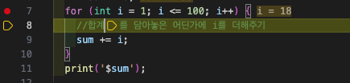

# 플러터 아침 스터디 기록

- 시작일자 : 2025년 12월 03일

## 목표

- [x] git 맛보기
- [ ] git 마스터
- [ ] 다트 마스터
- [ ] 플러터 마스터 

## Repository에 올리는 법
### 최초일 때
1. 깃허브 레포지토리 만들기
2. 폴더 만들기
3. VSCode에서 폴더 열고 올릴 파일 만들기
4. 저장소 초기화
 - `git init`
 - 초기화 하게 되면 `.git` 폴더가 생긴다.
5. 임시영역(스테이징 영역)에 파일 추가하기
 - 명령어 : `git add .`
 - `add` 뒤에 `.`은 현재 폴더 내의 모든 파일을 의미
 - 현재 폴더는 터미널에서의 작업 영역
6. 브랜치에 기록하기 (최종 저장)
 - 명령어: `git commit -m "커밋메시지"`
 - 커밋메시지는 어떠한 변경사항이 있었는지 메모하는 용도
7. 원격 저장소 연결
  - 명령어 (깃허브 레포지토리 윗블럭 가장 아래 3줄)
    ```sh
    git branch -M main
    git remote add origin https://github.com/bdtjin/flutter-study-9.git
    git push -u origin main
    ```
8. 깃 허브에 올리기 (7번에서 포함되어 있어서 안 해도 됨)
 -  명령어 : `git push -u origin main`


### 이후
1. 임시영역(스테이징 영역)에 파일 추가하기
 - 명령어 : `git add .`
 - `add` 뒤에 `.`은 현재 폴더 내의 모든 파일을 의미
 - 현재 폴더는 터미널에서의 작업 영역
2. 브랜치에 기록하기 (최종 저장)
 - 명령어: `git commit -m "커밋메시지"`
 - 커밋메시지는 어떠한 변경사항이 있었는지 메모하는 용도
3. 깃 허브에 올리기 (7번에서 포함되어 있어서 안 해도 됨)
 -  명령어 : `git push -u origin main`, `git push`


## 꿀팁
 - 맥에서 Option 버튼 + 백틱 누르면 한글일 때에도 백틱 입력된다. by 지은성 2025.12.03
 - vscode에서 command + J 누르면 터미널 열림
 - 파일 수정 후 항상 저장 필수! (파일 저장이 안 되었을 경우에 파일명 옆에 흰색 동그라미 떠있음)
 - VSCode 멀티라인 선택: 옵션+커멘드+화살표 위 또는 아래 전체 선택 가능
 - swich, for 문 만들때 VSCode 자동 완성 기능 활용해서 전체 블럭 만들기 가능 (자동완성 기능 밑에 네모난 박스)
 - 코드 라인수 옆에 클릭해서 빨간점(브레이크 포인트) 만들면 `디버그모드`에서 해당줄부터 한줄씩 실행하면서 변수 확인 가능
 - 
 - TODO 주석 작성할 때 `//` 바로 뒤에 TODO tree에 나옴
   - by 지은성 2025.12.12